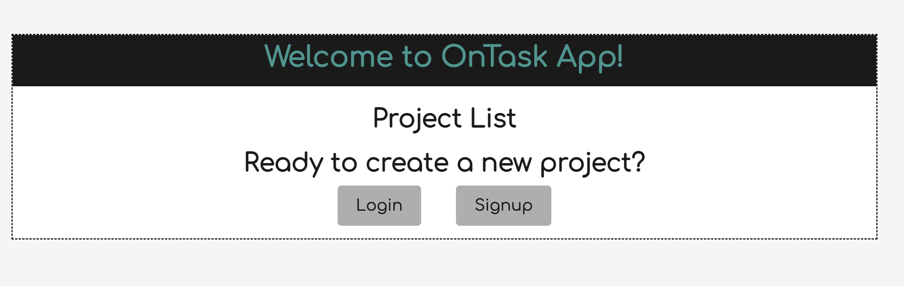
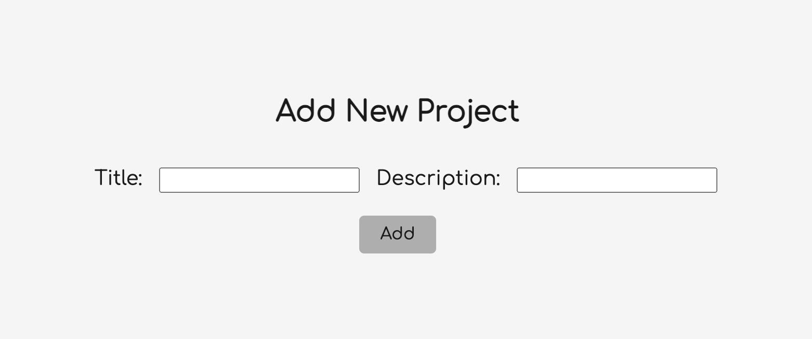
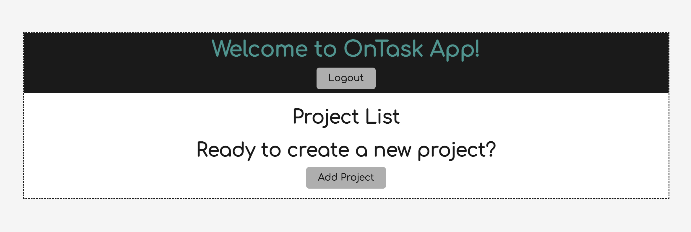

# Project 3: OnTask
   

## Description

Using MERN stack, an project management tool app, On Task, is created to help users keep track of their project progress and completion. 

## Installation
install npm  i
- node, express, mongoose, react, grapghql, apollo, bootstrap, jsonwebtoken

## Usage
The user is able to see all their projects, save and update their project status. 

## Assets
 This is the homepage, add project page, and logged in functionalities.

## Contributions/Licenses/Links
github: https://github.com/pppreap/project3_ontask

## Licenses

 
This application is covered by the MIT license. 

## Credits
MSU Boot Camp

## Tests
None

## Badges

## Questions
Any question Contact Me : 
Github Username: https://github.com/pppreap, codeyg12, jroller33, MartaS333  
Contact Email: pppreap@gmail.com
